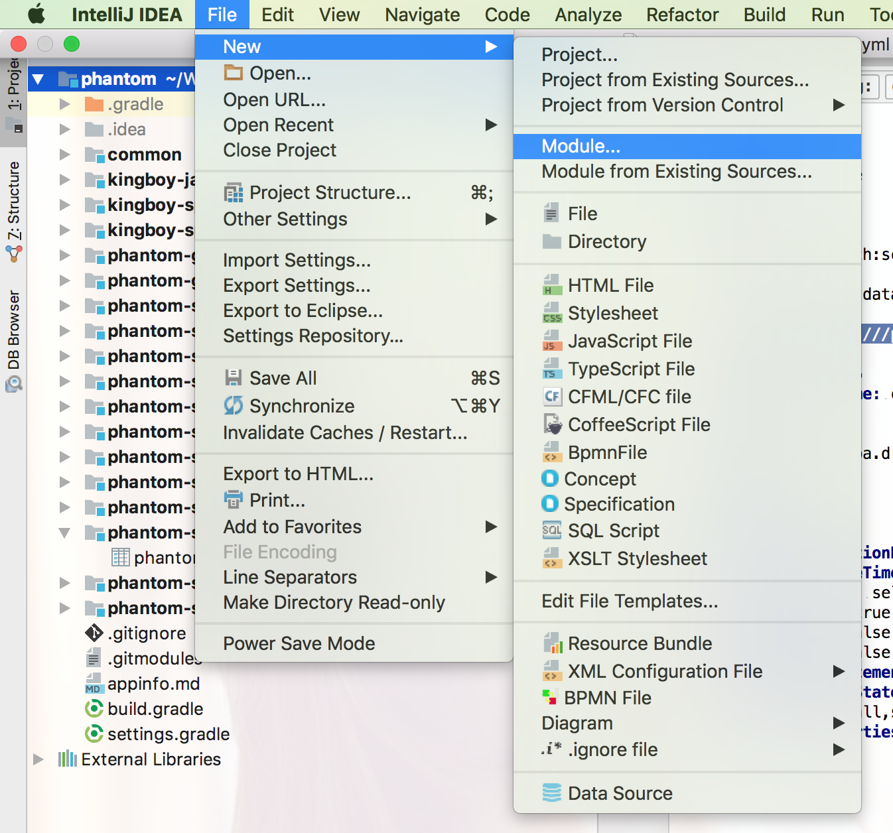

**由项目管理人员进行创建**

### 一、创建spring cloud module
> 1.选中根项目，File -> new module


> 2.spring initializer -> next

> 3.修改module属性


> 4.添加模块依赖


> 5.next -> finish


### 二、删除不需要的项目文件


### 三、拷贝需要的文件

> 1.拷贝file文件夹中的以下三个文件到resources中

<a href="file/logback-spring.xml">logback-spring.xml</a>
<a href="file/exception.properties">exception.properties</a>
<a href="file/bootstrap.yml">bootstrap.yml</a>

> 2.拷贝file中的以下文件到对应模块的根目录下

<a href="file/.gitignore">gitignore</a>

> 3.拷贝以下内容到项目的启动类中作为一个内部类即可(可参考其它模块)

```java
@RestController
class IndexController {

    @Value("${spring.application.name}")
    private String applicationName;

    @GetMapping(value = "/", produces = MediaType.TEXT_HTML_VALUE)
    public String index() {
        return "<html>"
                + "<head><title>" + applicationName + "</title></head>"
                + "<body>"
                + "<h1 style='text-align: center;margin: 100px;padding: 50px;background-color: lightskyblue;'>"
                + "欢迎访问" + applicationName + "!"
                + "</h1>"
                + "</body>"
                + "</html>";
    }

}
```

> 4.拷贝file中base文件夹到项目中com.kingboy.common.config目录中


### 四、修改对应的文件

> 1.resources目录中的bootstrap.yml


> 2.模块根目录中的build.gradle替换为file中的build.gradle内容，
    - 其中功能点依赖请自行修改


### 六、创建对应的数据库文件

在resources目录中创建`schema.sql`与`data.sql`两个文件，分别用来存放表结构和假数据，如下参考(根据模块自行更改)
    
scheme.sql
```mysql
CREATE TABLE IF NOT EXISTS `user` (
  `id` bigint(20) NOT NULL AUTO_INCREMENT,
  `age` int(11) DEFAULT NULL,
  `balance` decimal(19,2) DEFAULT NULL,
  `name` varchar(255) COLLATE utf8_unicode_ci DEFAULT NULL,
  `username` varchar(255) COLLATE utf8_unicode_ci DEFAULT NULL,
  PRIMARY KEY (`id`),
  index(`id`),index(`username`)
) ENGINE=InnoDB AUTO_INCREMENT=12 DEFAULT CHARSET=utf8 COLLATE=utf8_unicode_ci;
```

data.sql，注意其中的delete from user,小心造成生产事故(根据模块自行更改)
```mysql
delete from user;
INSERT INTO `user`(id, username, name, age, balance) VALUES (1, 'account1', '张三', 18, 100.00);
INSERT INTO `user`(id, username, name, age, balance) VALUES (2, 'account2', '李四', 19, 180.00);
INSERT INTO `user`(id, username, name, age, balance) VALUES (3, 'account3', '王五', 20, 150.00);
INSERT INTO `user`(id, username, name, age, balance) VALUES (4, 'account4', '小红', 18, 500.00);
```

### 五、创建包结构

    |--controller                       对外接口
        |--IndexController              以Controller结尾
        |--user                         每个功能点建立一个单独的包
            |--UserController           
    |--service                          服务层
        |--user                         功能点包
            |--UserService              service接口
            |--impl                     实现包
                |--UserServiceImpl      service实现
    |--repository
        |--user                         功能点包
            |--UserRepository           仓储接口
            |--impl                     实现包
               |--UserRepositoryImpl    仓储实现类
            |--entity                   实体
               |--UserEntity            实体，以Entity结尾
    |--dto
        |--user
            |--request                  请求载体以DTO结尾
                |--UserAddDTO           
            |--response                 响应载体以DTO结尾
                |--UserPageDTO
    |--common                           基础包
        |--config                       配置包
        |--tools                        不是所有模块都会用的工具类放在这里，公共工具类放在common的模块的中

### 六、创建远程仓库(仓库名为模块名)，并将该module提交到远程仓库
> 1.创建对应的远程仓库，例如url为：http://github.com/kingboyworld/phantom-service-user.git
> 2.进入本模块(phantom-service-user)目录下执行以下命令将仓库提交到远程仓库
```
git init
git remote add origin http://github.com/kingboyworld/phantom-service-user.git
git add .
git commit -m "init"
git push -u origin master
```


### 七、删除本地module文件，重新克隆(因为待会要将其添加到总项目的子项目，如果文件存在，会添加失败)
> 1.删除本地module文件
> 2.进入到总项目根目录，执行以下命令即可将刚刚创建的项目重新拉取(这时候在.gitmodule文件中会添加一条记录)
```
git submodule add http://github.com/kingboyworld/phantom-service-user.git
```
> 3.修改项目信息
    - 在总项目根目录中的setting.gradle文件中将我们创建的项目添加进去。
    
    - 在appinfo.md文件添加我们创建的模块信息，抢占一个端口。
    ```
        > ### 用户服务
        >> 端口：8000
        >>
        >> 名称: phantom-service-user
        >>
        >> 地址: http://localhost:8000
    ```

### 八、建立项目的配置moduel

> 1.在gitlab/github中建立一个仓库，仓库命名为: [模块名]-conf
> 2.将该仓库克隆到本地的随意目录
> 3.在该仓库中新建一个文件，文件名： [模块名].yml  ，在该文件中添加如下内容，并修改其中的server.port，以及删除不需要的配置
```yml
#服务端口                                     ==必填==
server:
  port: 8000

#启用hystrix
feign:
  hystrix:
    enabled: true
  #启用压缩
  compression:
    request:
      #压缩的类型
      mime-types: application/json
      #压缩阀值，1k
      min-request-size: 1024

#针对每个服务设置ribbon超时和请求重试
phantom-service-provider:
  ribbon:
    ConnectTimeout: 500
    ReadTimeout: 3000
    OkToRetryOnAllOperation: true
    MaxAutoRetries: 5
    MaxAutoRetriesNextServer: 2

#关闭超时检查,否则第一次的服务间请求会失败
hystrix:
  command:
    default:
      execution:
        timeout:
          enabled: false
          
#设置actuator开关
management:
  security:
    enabled: false

#KingBoy自定义配置
king:
  #controller/service/repository的日志打印功能
  log:
    #是否启用
    enabled: true
  #swagger程序文档功能
  swagger:
    #是否启用
    enabled: true
    #controller包位置
    base-package: com.kingboy.controller
    title: 生产模块接口文档
    description: 主要包含UserController接口
    version: V1.0

spring:
  #zipkin的采样率
  sleuth:
    sampler:
      percentage: 1.0
  #rabbitmq配置
  rabbitmq:
    host: localhost
    port: 5672
    username: guest
    password: guest
  #jpa配置
  jpa:
    show-sql: true
    hibernate:
      ddl-auto: none
  #数据源配置
  datasource:
    #执行的建表语句
    schema: classpath:schema.sql
    #执行的sql语句
    data: classpath:data.sql
    #主配置
    url: jdbc:mysql:///provider?useUnicode=true&characterEncoding=utf-8&useSSL=false
    username: root
    password: 123456
    driver-class-name: com.mysql.jdbc.Driver
    #其它配置
    platform: mysql
    type: com.alibaba.druid.pool.DruidDataSource
    initialSize: 5
    minIdle: 5
    maxActive: 30
    maxWait: 60000
    timeBetweenEvictionRunsMillis: 60000
    minEvictableIdleTimeMillis: 30000
    validationQuery: select 'x'
    testWhileIdle: true
    testOnBorrow: false
    testOnReturn: false
    poolPreparedStatements: true
    maxPoolPreparedStatementPerConnectionSize: 20
    filters: stat,wall,slf4j
    connectionProperties: druid.stat.mergeSql=true;druid.stat.slowSqlMillis=5000

#设置mybatis结果自动驼峰映射
mybatis:
  configuration:
     map-underscore-to-camel-case: true
```

    小提示：模块名就是在bootstrap.yml文件中定义的spring.application.name


> 4.将仓库提交到远程仓库

```
    git add .
    git commit -m "init"
    git push -u origin master
```

> 5.进入总项目根目录，执行以下命令

```
    git add submodule gitUrl
```

> 6.在总项目的setting.gradle文件中添加此模块。(前面已有，不再赘述)


### 九、在数据库中建立数据库名

    编码如下


### 十、项目启动流程

> 1. phantom-server-eureka
> 2. phantom-server-config
> 3. phantom-service-*
